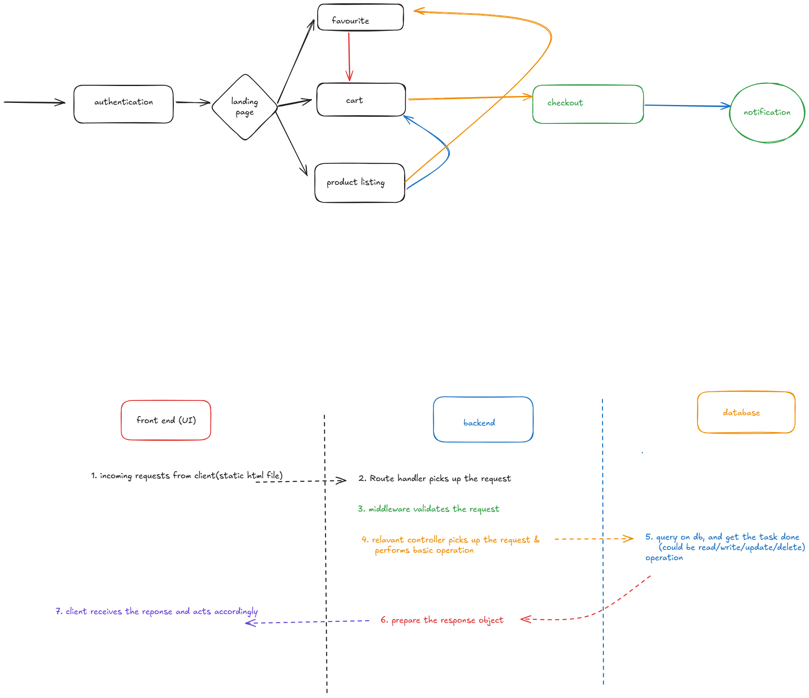

# E-commerce Project - Backend Functionality

## Problem Statement

The E-commerce Project aims to create a fully functional backend for an e-commerce platform. This project focuses on building APIs to handle core e-commerce functionalities, such as product listing, user authentication, cart management, favorites management, and order placement. The backend is built with Node.js, Express.js, and MongoDB, ensuring a scalable and secure system with proper routing, authentication, and database management.
## Features

### 1. **System Architecture**
The architecture follows the **Model-View-Controller (MVC)** pattern:
- **Model**: MongoDB stores the product, user, cart, and order data.
- **View**: The frontend interacts with the backend through API calls, displaying data like products, user details, and orders.
- **Controller**: Express routes handle CRUD operations, manage data flow, and ensure proper handling of business logic.

### 2. **Product Details and Routing**
- **Product JSON**: Product details are stored in a JSON file and served to the frontend.
- **Basic Routing**: Routes are set up using **Express.js** to handle **GET** requests for fetching product details.
- **Postman Integration**: Use **Postman** to test product-related API routes before integration with the frontend.
- **Frontend Integration**: The frontend connects to the backend via API routes to display product data on the user interface.

### 3. **User Authentication and Welcome Emails**
- **JWT Authentication**: Users can sign up and log in using **JWT tokens** for secure authentication.
- **Login & Signup Pages**: The backend handles **POST** requests for login and signup functionality, validating credentials and generating a token.
- **Welcome Email**: After successful registration, a **welcome email** is sent to the user using **Nodemailer**.

### 4. **CRUD Operations on User Details**
- **User Management**: APIs are created for **CRUD operations** to manage user details (e.g., name, profile picture, address, etc.).
  - **GET**: Retrieve user details.
  - **POST**: Create new users.
  - **PUT**: Update existing user details.
  - **DELETE**: Remove a user’s data.
- **Middleware**: Middleware is used for **authentication** and **validation** to protect sensitive routes.

### 5. **Cart and Favorites APIs**
- **Cart Management**: APIs to handle adding, updating, retrieving, and deleting items in the user's shopping cart.
  - Users can **add products** to their cart, **update quantities**, or **remove items**.
- **Favorites Management**: Similar APIs allow users to **add products** to their favorites list for future purchase.
- Data is stored in the **MongoDB database**, ensuring cart and favorites lists are persistent across user sessions.

### 6. **Order Placement API**
- **Order Creation**: An API is implemented to place an order, storing details such as:
  - Products in the order
  - Quantity
  - Total price
  - Order status
- **Order ID Generation**: Each order is assigned a **unique order ID**, and the order details are stored in the database for later reference.

### 7. **Deployment and Cloud Database Integration**
- **MongoDB Atlas**: **MongoDB** is hosted on **MongoDB Atlas**, providing a cloud-based database for storing user data, products, and orders.
- **Deployment on Render**: The project is deployed on **Render** or similar cloud platforms, ensuring continuous uptime and accessibility.
- **Environment Configuration**: Proper configuration of the cloud database and server environment, including MongoDB Atlas integration.

## Technologies Used
- **Node.js**: Server-side JavaScript runtime for building the backend.
- **Express.js**: Framework for building API routes and handling HTTP requests.
- **MongoDB**: NoSQL database used to store product, user, and order data.
- **Mongoose**: ODM library for interacting with MongoDB and defining models.
- **JWT**: JSON Web Token for secure authentication and managing sessions.
- **Nodemailer**: For sending email notifications like welcome emails to new users.
- **Postman**: Used for API testing and validating API routes.
- **Render**: Cloud platform for server hosting and backend deployment.
- **MongoDB Atlas**: Cloud service for MongoDB database hosting.

